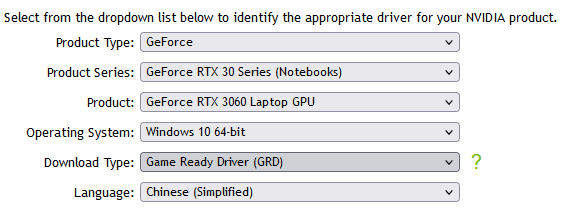

# windows深度学习环境搭建

## 下载驱动+Cuda+cuDNN

驱动下载地址：https://www.nvidia.com/Download/index.aspx?lang=en-us



Cuda下载地址：https://developer.nvidia.com/cuda-toolkit-archive （选择在线安装，方便安装时自定义安装少量必要项即可）

cuDNN下载地址：https://developer.nvidia.com/zh-cn/cudnn  (大概率需要VPN访问）

注：

高版本驱动向下兼容Cuda,Cuda需满足最低驱动版本号，详见：https://docs.nvidia.com/cuda/cuda-toolkit-release-notes/index.html#cuda-major-component-versions__table-cuda-toolkit-driver-versions

一个Cuda可对应多个cuDNN（加速包），可同时安装多个版本的Cuda

## torch下载

下载地址：https://download.pytorch.org/whl/torch_stable.html

注：

注意和Cuda版本号相匹配，包含torch、torchvision、torchaudio

## tensorflow 下载

GPU版下载地址：https://pypi.tuna.tsinghua.edu.cn/simple/tensorflow-gpu/

CPU版下载地址：https://pypi.tuna.tsinghua.edu.cn/simple/tensorflow/

tensorflow、cuDNN、Cuda对应关系

详见：https://tensorflow.google.cn/install/source_windows


## 安装驱动+Cuda+cuDNN（事先安装visual studio）

安装驱动：自定义——physx系统软件（不需要）——执行“清洁安装”模式

安装Cuda:自定义——只需安装Cuda本体即可（NVIDIA GeForce Experience、PhysX、Diver components不需要）

安装cuDNN:解压——将文件夹内所有文件拷贝到Cuda安装目录下

注：

查看cuda安装目录：set cuda 

查看cuda版本号：nvcc -V

查看显卡版本驱动号： nvidia-smi（可看到 显卡驱动版本、支持的最高cuda版本、显卡使用情况）

## 安装torch和tensorflow

pip install +包名

测试torch:

```
import torch
import os
print(torch.cuda.is_available())
# cuda是否可用
print(torch.cuda.device_count())
# 返回gpu数量
print(torch.cuda.get_device_name(0))
# 返回gpu名字，设备索引默认从0开始
print(torch.cuda.current_device())
```

测试tensorflow:

```
from tensorflow.python.client import device_lib
# 列出所有的本地机器设备
local_device_protos = device_lib.list_local_devices()
print(local_device_protos)
```


## 用anaconda 管理python虚拟环境

anaconda下载地址：https://www.anaconda.com/download/（安装是勾选添加环境变量）

创建python环境：conda create -n [环境名] python=[版本号]

删除python虚拟环境：conda remove --name [环境名] --all

查看所有python虚拟环境：conda env list

激活进入python虚拟环境：activate [环境名]

退出python虚拟环境：deactivate

查看所在python虚拟环境所安装的包：pip list


## 常用镜像源

清华：https://pypi.tuna.tsinghua.edu.cn/simple/

豆瓣：http://pypi.doubanio.com/simple/

阿里：http://mirrors.aliyun.com/pypi/simple/


