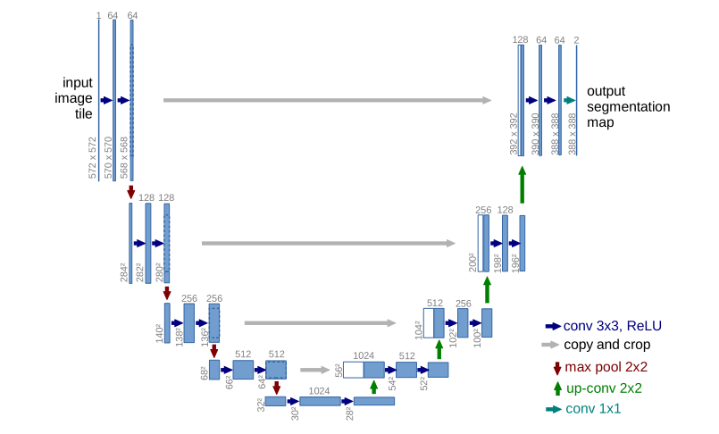

### Note

《U-Net: Convolutional Networks for Biomedical Image Segmentation》

### 特点

基于少量数据进行训练的网络的模型，精度相较CNN高，速度较快

### 结构

编码器——下采样

feature channels数量2倍增加，conv+max-pool实现

解码器——上采样

feature channels数量2倍减少，利用编码器（左边）的feature map拷贝和剪裁（镜像操作）+up_convolution实现（最后一层特殊处理）

### 训练

输入512*512尺寸图像

输出两个尺寸为388*388的Feature Map——二分类任务

利用数据扩充增加样本数量
